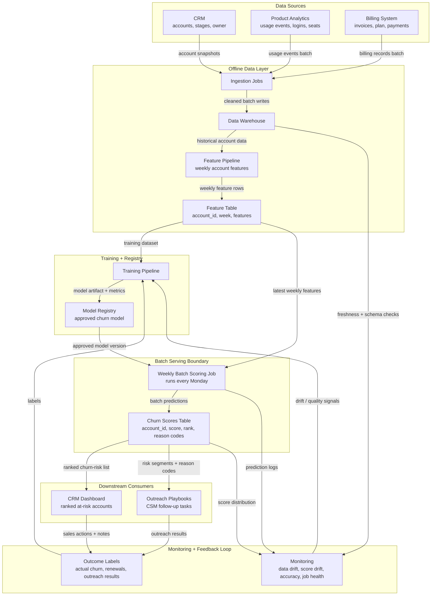

# Architecture — Weekly Churn Prediction System

Scenario: **B — Weekly churn predictions for a B2B SaaS company**

Serving pattern: **Batch inference**

## Notes

This architecture uses **batch inference** because the business only needs updated churn scores once per week. The sales team receives a ranked list every Monday morning and uses the same list throughout the week.

The serving boundary is the weekly batch scoring section: the approved model is loaded from the model registry, the latest account features are read from the feature table, and the output is written to the churn scores table.

The feedback loop comes from monitoring signals, actual churn outcomes, renewals, and sales outreach results. These outputs feed the next training cycle so the model can improve over time.
